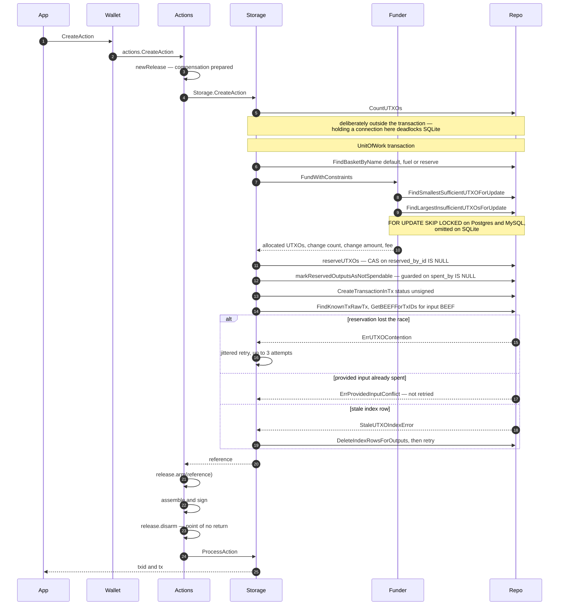
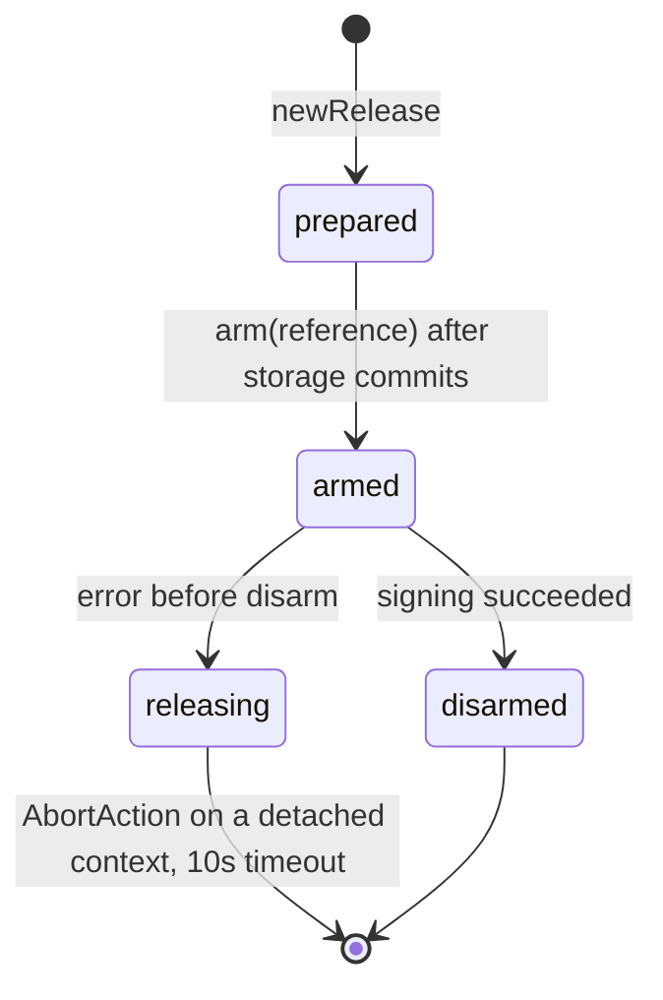
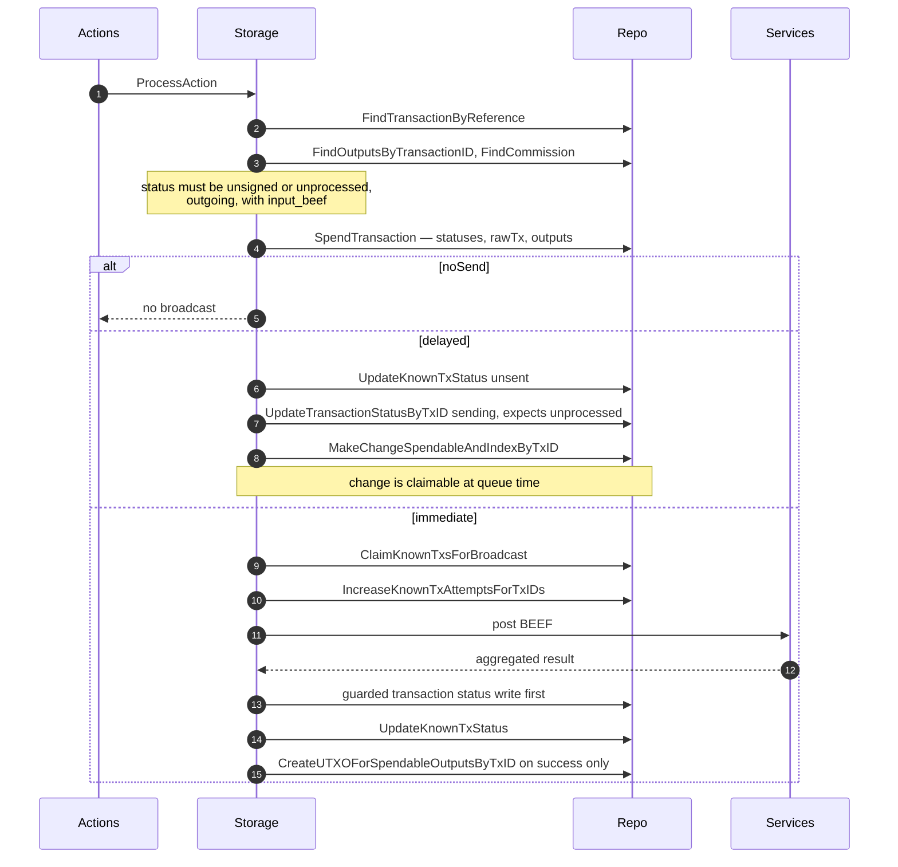
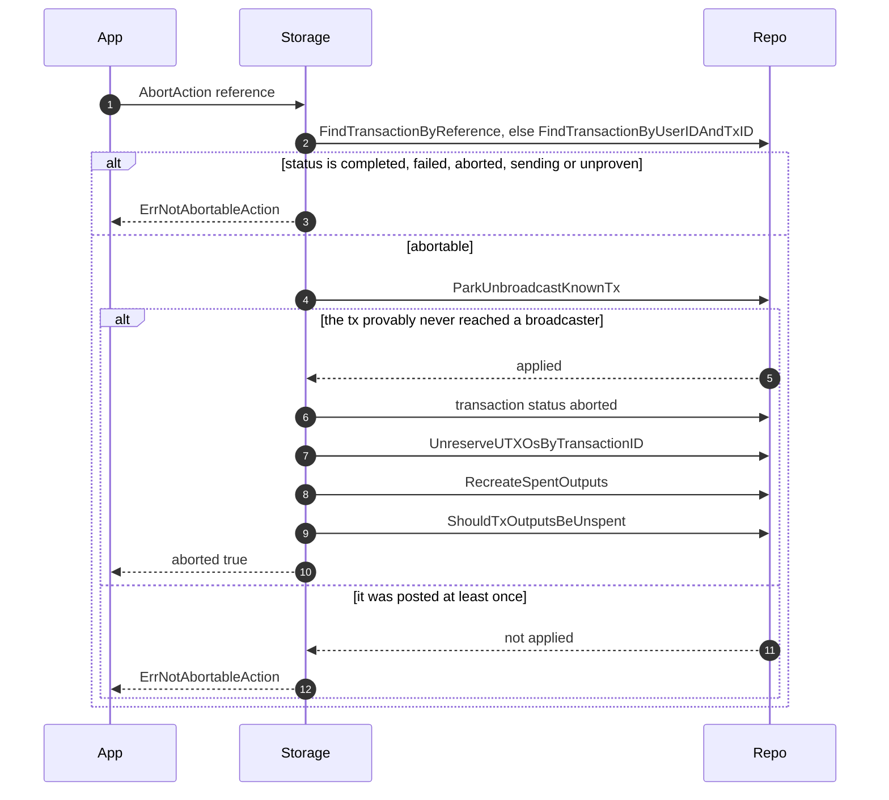

## UTXO LIFECYCLE: BSV Wallet Toolbox

This page traces a transaction through the BRC-100 wallet interface as implemented here:
which layer does what, which repository calls each method makes, and what state the
transaction and its outputs are left in.

The cross-implementation view — the same lifecycle described against the BRC-100
specification with the TypeScript implementation side by side — lives in
[`ts-stack/docs/architecture/wallet-utxo-lifecycle.md`](https://github.com/bsv-blockchain/ts-stack/blob/main/docs/architecture/wallet-utxo-lifecycle.md).
This page is the Go-specific half: the repository layer, the two-phase UTXO reservation,
and the release compensation machine, none of which have TypeScript counterparts.

### Layers

| Layer | Package |
|---|---|
| Wallet | `pkg/wallet/wallet.go` — BRC-100 surface, asserts `sdk.Interface` |
| Actions | `pkg/wallet/internal/actions/` — create/sign orchestration, release compensation |
| Manager | `pkg/storage/storage_manager.go` — auth injection, active/backup routing |
| Provider | `pkg/storage/provider.go` — implements `wdk.WalletStorageProvider` |
| Storage actions | `pkg/storage/internal/actions/` — create, process, abort, internalize, list |
| Funder | `pkg/internal/storage/funder/` — coin selection |
| Repo | `pkg/internal/storage/repo/` — SQL, reservations, guarded status writes |
| Monitor | `pkg/monitor/` — background convergence |

The seam that matters is `pkg/storage/internal/actions/repos.interface.go`: `BasketRepo`,
`OutputRepo`, `TransactionsRepo`, `KnownTxRepo`, `UTXORepo`, `CommissionRepo`,
`KeyValueRepo`, and the `UnitOfWork` that runs them in one database transaction.

### CreateAction

### Reservation is two-layered

`bsv_user_utxos` is the funder's claim index; `bsv_outputs` is spend truth. They move
independently inside the same transaction and fail for different reasons.

| Write | Guard | Failure |
|---|---|---|
| `reserveUTXOs` sets `reserved_by_id` | `reserved_by_id IS NULL` | row-count mismatch → `wdk.ErrUTXOContention`, retried |
| `markReservedOutputsAsNotSpendable` sets `spendable=false, spent_by` | `spent_by IS NULL` | `StaleUTXOIndexError` or `repo.ErrProvidedInputConflict`, not retried |

Only `ErrUTXOContention` is retried, because it means another `CreateAction` won a fair
race. `ErrProvidedInputConflict` means the caller asked to spend something already spent,
which no retry can fix.

Index rows are created when a change output is made spendable, promoted by
`MakeChangeSpendableAndIndexByTxID` or `CreateUTXOForSpendableOutputsByTxID`, restored by
`RecreateSpentOutputs`, and deleted on successful spend or on relinquish. The partial
index `idx_user_utxos_claim` covers `WHERE reserved_by_id IS NULL`, which is the claim
path.

### Release compensation

`CreateAction` is not atomic end to end: storage commits the funded transaction, then the
wallet assembles and signs. A failure in between would strand reserved UTXOs.

Both the wallet layer (`pkg/wallet/internal/actions/release.go`) and the storage layer
(`pkg/storage/internal/actions/release.go`) implement this. The detached context matters:
the caller's context is usually already cancelled by the time compensation runs.

### ProcessAction and broadcast

Broadcast outcomes:

| Aggregated result | KnownTx | Transaction | Change spendable |
|---|---|---|---|
| success | `unmined` | `unproven` | yes |
| double spend | `doubleSpend` | `failed` | no |
| invalid tx | `invalidTx` | `failed` | no |
| service error | `sending` | `sending` | no |

The transaction write happens **before** the failure cascade and the KnownTx downgrade,
guarded to `unprocessed`, `sending`, `nosend`, or `unproven`. If it matches zero rows the
result is late — the transaction is already proven or terminal — and the whole update is
skipped with a warning rather than downgrading a proven transaction.

Service error keeps change unspendable by design: with no network evidence the transaction
may never have been accepted, so the UTXOs are only created on the success path.

### Failure does not restore inputs

When a broadcast returns double-spend or invalid, created outputs are marked not
spendable and **spent inputs are deliberately left spent**. A missing-inputs or
double-spend verdict can be a false positive, and re-spending an input that is still valid
risks a real double spend; losing access to the input is the safer failure.

Only `AbortAction` and the abandoned sweep restore inputs, via `RecreateSpentOutputs`.

This is the opposite default from the TypeScript implementation, which releases inputs on
`failed` and then re-marks only those the chain positively confirms are gone. Neither
behavior is specified by BRC-100.

### AbortAction

Abortable statuses are `unprocessed`, `unsigned`, `nosend`, `nonfinal`, and `unfail`. The
`ParkUnbroadcastKnownTx` gate requires a never-posted status, `was_broadcast` false, and
zero attempts — local evidence, so the guard holds even when network services are
unreachable.

### Status vocabularies

`wdk.TxStatus` — `completed`, `failed`, `unprocessed`, `sending`, `unproven`, `unsigned`,
`nosend`, `nonfinal`, `unfail`, and **`aborted`**. The last is a Go extension
distinguishing a retryable abort from a permanent failure; TypeScript folds both into
`failed`. See `docs/superpowers/specs/2026-07-20-aborted-tx-status-design.md`, which
records it as a known BRC-100 wire-parity ceiling.

`wdk.ProvenTxReqStatus` — `sending`, `unsent`, `nosend`, `unknown`, `nonfinal`,
`unprocessed`, `unmined`, `callback`, `unconfirmed`, `completed`, **`invalidTx`**,
`doubleSpend`, `unfail`, **`reorg`**. TypeScript spells the terminal failure `invalid` and
has no `reorg` status.

`wdk.UTXOStatus` — `sending`, `unproven`, `mined`, and the empty placeholder, which makes
a row invisible to the funder. Tier ordering lives in `funder/pool.go`.

Guarded status writes go through `UpdateTransactionStatusBy{TxID,ID}` with
`expectedCurrent...` as a positive precondition, returning `repo.ErrStatusUpdateSkipped`
when nothing matched.

### Coin selection

`funder.SQL.FundWithConstraints` runs three phases: priority outputs (`noSend` change
carried forward), sweep (exhaustive paging for a max-satoshis output), and bounded tiered
best-fit. The bounded allocator walks status tiers, issuing one smallest-sufficient probe
and one largest-insufficient batch of sixteen per tier, so cost is flat in pool size
rather than linear.

Change count derives from `minimum_desired_utxo_value`, clamped by
`number_of_desired_utxos` and `max_change_outputs_per_tx`, then shrunk while any slice
would fall below the dust floor — twice the fee of spending a minimal P2PKH input. Change
below the dust floor is donated to the fee instead of being created.

Baskets: `default` for change, `fuel` and `reserve` for the throughput strategy. Non-change
baskets get zeroed heuristics. See `plans/high-throughput-utxo-management.md` for the
denominated-pool design and `pkg/defs/utxo_management.go` for the configuration surface.

### Monitor

Four tasks are registered in `pkg/monitor/all_tasks.go`:

| Task | Effect |
|---|---|
| `check_for_proofs` | `SynchronizeTransactionStatuses` — fetches proofs, marks mined |
| `send_waiting` | `SendWaitingTransactions` — broadcasts queued and stale transactions |
| `fail_abandoned` | `AbortAbandoned` — sweeps aged non-terminal transactions to `aborted` |
| `un_fail` | `UnFail` — retries operator-flagged failures |

The TypeScript implementation ships nineteen tasks. Statuses that only its
review-status cascade, double-spend review, reorg handling, `nosend` settlement, or UTXO
review advance do not advance here.

### Known parity gaps

Tracked in `plans/`, and mirrored in the ts-stack page's difference list:

| Issue | Gap |
|---|---|
| `issue-818-internalize-broadcast.md` | `InternalizeAction` broadcasts in band in TypeScript, only queues here |
| `issue-819-process-action-error-fields.md` | `WERR_REVIEW_ACTIONS` lacks `txid`, `tx`, `sendWithResults`, `reviewActionResults`, `noSendChange`; `SignAction` `noSendChange` incomplete |
| `issue-820-list-outputs-include-labels.md` | `ListOutputs` `includeLabels` |
| `issue-821-list-outputs-known-txids.md` | `knownTxids` and BEEF trimming |
| `issue-822-list-actions-brc114-time.md` | BRC-114 time-control labels in `ListActions` |
| `issue-776-inputbeef-json-array.md` | `inputBEEF` JSON wire format against TypeScript storage servers |
| `issue-769-cert-type-serial-wire.md` | certificate type and serial wire format |

Two further differences are not yet tracked as issues:

- **`GetNetwork` returns `main` and `test`**, not the `mainnet` and `testnet` BRC-100
  requires. The conformance suite documents this and configures around it
  (`pkg/wallet/brc100_conformance_test.go`).
- **The V1 storage client returns empty results for two methods.**
  `findOutputBasketsAuth` and `findOutputsAuth` in `pkg/storage/client.go` return empty
  collections with a nil error, which a caller cannot distinguish from a genuine empty
  result. `SetActive` and `ProcessSyncChunk` return not-implemented errors.

Conformance vectors here are vendored: ten of the twenty-seven BRC-100 vector files,
pinned by `conformance/SOURCE`. The remaining seventeen are not exercised against this
implementation.

### See also

- [`docs/storage.md`](./storage.md) — storage components and configuration
- [`docs/wallet.md`](./wallet.md) — wallet surface and options
- [`docs/monitor.md`](./monitor.md) — monitor daemon
- [`plans/high-throughput-utxo-management.md`](../plans/high-throughput-utxo-management.md) — denominated pool design
